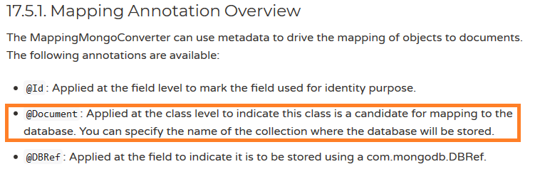
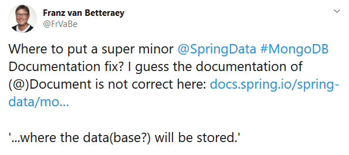
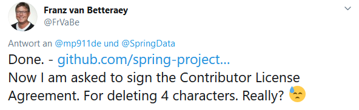
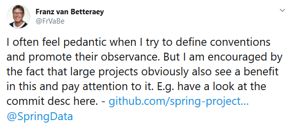
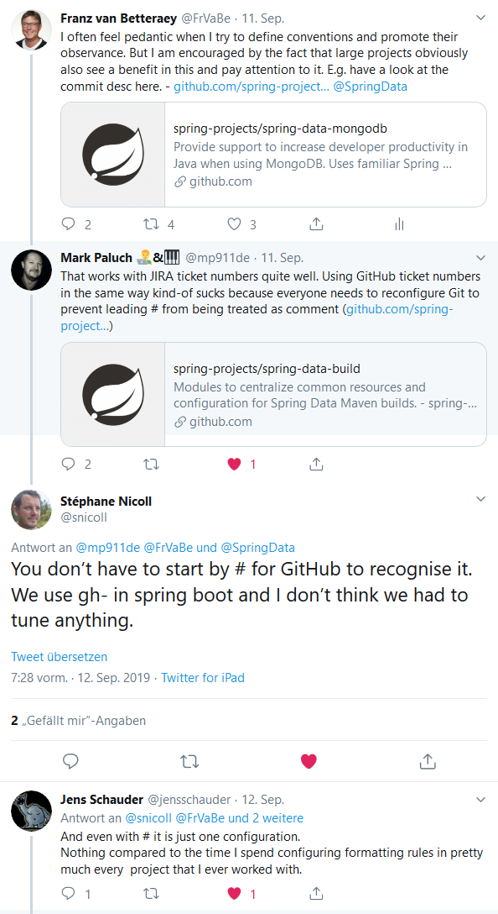
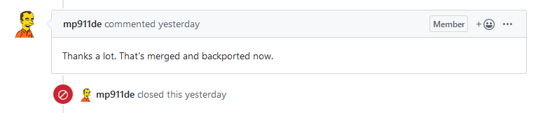

# Is it worth reporting an obvious and trivial documentation error?

A few days ago I had to look something up in the [Spring Data MongoDB](https://docs.spring.io/spring-data/mongodb/docs/2.1.10.RELEASE/reference/html/) documentation. I wasn't sure which annotation to use to determine in which collection an entity should be written. I found the explanation for `@Document`, which was obviously what I was looking for:



So that's how it works! But what does the description say?

> [...] where the database will be stored.

This is obviously wrong. It's not where the _data**base**_ is stored, it's where the **data** is stored.
Small mistake, not nice, but not tragic either. Who cares?

At that moment I took care of it. 
Why shouldn't I draw someone's attention to it so that the error can be corrected?
Such errors annoy me myself and I can also imagine that the author of the documentary is happy to be made aware of such errors. 

Said & done. I know that [Spring Data](https://twitter.com/SpringData) people listen to Twitter and first "reported" the bug there. My idea was that a maintainer just makes the necessary commit quickly and the job is done.

<a href="https://twitter.com/FrVaBe/status/1171451198081122306"></a>

As feared, I was advised to provide a pull request for the fix. So the reporting would bit more complex than I thought but I prepared the pull request. Because the fix was so trivial I could do it completely in the GitHub user interface. In the pull request description template I got the hint that there should be a corresponding Jira Ticket. Pooh,...

Spring Jira; I once have already registered myself but the old logon data which I could remeber, did not work any more. Attempts to restore the account failed and I finally created a new account and open the JIRA ticket [DATAMONGO-2361](https://jira.spring.io/browse/DATAMONGO-2361).

Back to GitHub I noticed that the Spring Data MongoDB branches all follow the naming convention _'issue/DATAMONGO-xyz'_ and therefore I created a new branch also following this convention. And finally the pull-request was set up:

> [#787 - fix @Document description (DATAMONGO-2361)](https://github.com/spring-projects/spring-data-mongodb/pull/787)

Quite quickly came the request to sign a Contributor License Agreement (CLA). I can understand that, but before I sign anything I want to read and understand it. So the whole thing will be a bit more elaborate.
As you might expect, I had a bit of a whinge on Twitter, of course.

<a href="https://twitter.com/FrVaBe/status/1171867162199371777"></a>

The moaning was successful! Mark Paluch (Spring Data Project Lead / [@mp911de](https://twitter.com/mp911de)) released me from the CLA. The fix is too obvious for me to hold any property right on it ;-)

But what Mark did now? He changed the pull request title:

```
 was: fix @Document description (DATAMONGO-2361)
 new: DATAMONGO-2361 - fix @Document description.
```

Why? If you take a look at the Spring Data Mongo DB [commit history](https://github.com/spring-projects/spring-data-mongodb/commits/master) you will understand why. All commits follow the naming convention

    <JIRA issue> - <description>

This means that there is also a Jira issue for every commit. No commit without issue! And strong adherence to the conventions.
That impressed me. And since I'm not only complaining on Twitter, I also praised it.

<a href="https://twitter.com/FrVaBe/status/1171871263066927107"></a>

What should I say; a [small conversation](https://twitter.com/snicoll/status/1172019189445464064) with some Spring maintainers arose out of it, which extended my knowledge horizon again a little bit. 



Mark Paluch ([@mp911de](https://twitter.com/mp911de) - which I mentioned already above and who took care about my pull request), Stéphane Nicoll ([@snicoll](https://twitter.com/snicoll)), Jens Schauder ([@jensschauder](https://twitter.com/jensschauder)) and Florent Biville ([@fbiville](https://twitter.com/fbiville) / [here](https://twitter.com/fbiville/status/1172057268843700225)) - thank you!

To top it all off, my tweet was also retweeted by Senior Principal Software Engineer Oliver Drotbohm @Pivotal ([@odrotbohm](https://twitter.com/odrotbohm)) and even our local (Aachen) Java Champion and my friend Michael ([@rotnroll666](https://twitter.com/rotnroll666)) has [mentioned the contribution](https://twitter.com/rotnroll666/status/1172016880007163906). **What a day!** ;-).

Finally, the pull request was even merged as well. And I contributed to the Spring Data MongoDB project (by deleting four characters). **How cool is that?**

<a href="https://github.com/spring-projects/spring-data-mongodb/pull/787#issuecomment-531157576"></a>

For me, the fix at the end was not relevant, but the look into the working methods of others and the small conversations and interaction with the community were worth every minute.

<h1>tl;dr</h1>

It was worth it (for me) because

* an error was corrected
* I got to know a project and a small part of its work process
* I got in touch with smart people which took care of me and helped
* I have benefited from a small discussion

# final note

Getting in touch with people is sometimes difficult and I don't do it easily myself. Twitter often makes it easy, but there are other ways.
Many of the people mentioned here have already visited and presented at [EuregJUG](http://www.euregjug.eu/), for example.
Take the opportunity to visit a JUG or a Meetup near you if you feel like making new contacts. It can be worth it.

**Edit:** Thanks to [Josh Long](https://twitter.com/starbuxman) for mentioning this little post in [This Week in Spring - September 24th, 2019](https://spring.io/blog/2019/09/24/this-week-in-spring-september-24th-2019)


