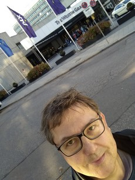
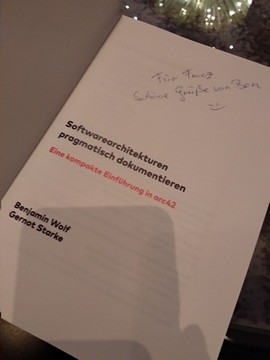
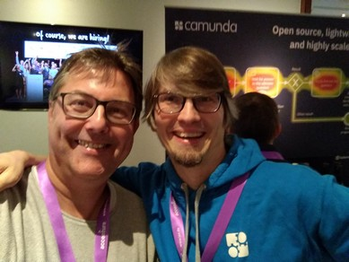
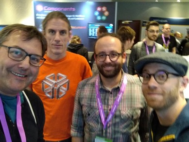
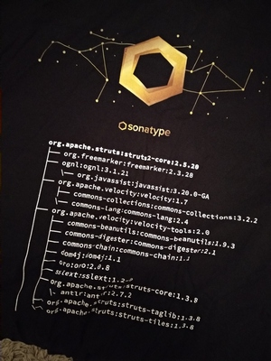

# Eine Konferenz als Fremder besuchen

Ich habe das Glück von Zeit zu Zeit, von meinem Arbeitgeber finanziert, an Konferenzen teilnehmen zu können.
Tatsächlich habe ich das bisher nur so in Anspruch genommen, dass ich alle 2 Jahre die W-JAX in München besuche. Dieses Jahr (2019) war es wieder soweit.

Für mich ist eine Konferenz immer eine willkommene Abwechslung vom Arbeitsalltag.
Mich interessiert dabei meist kein ganz spezielles Thema, sondern ich erhoffe mir immer einen Eindruck zu bekommen wo die IT-Industrie (bzw. der Bereich in dem ich mich bewege) steht - und wo die Reise hingeht.
Die W-JAX mit dem recht breiten Themenspektrum bietet da für mich eine Vielzahl von Information.

Allen voran sind da natürlich die Vorträge und Ausstellungen. Aber zwischen den Vorträgen gibt es eine Menge Zeit. 
Wenn man niemanden kennt und auch selbst nicht bekannt ist, kann man sich da ganz schön alleine fühlen.

Die Pausenzeit ist aber zu schade um sie einfach verstreichen zu lassen.
Gerade Konferenzen bieten viel Raum zum Netzwerken der genutzt werden möchte, aber wie?

Ich stelle hier mal ein paar Möglichkeiten vor die ich dieses Jahr genutzt habe. 
Sie haben mir geholfen als Fremder auf der Konferenz eine gute Zeit zu verbringen und auch viel Spaß zu haben.

## 1. Kommen ankündigen

Ich habe auf Twitter und Xing (ja, ich weiss...) mein Kommen angekündigt und gehofft ein paar Bekannte zu finden, die auch zur Konferenz fahren.
Das hat leider nicht gut funktioniert und es gab kein wirkliches Feedback.
Aber meine Reichweite ist auch nur gering ;-).

## 2. Wissen was kommt

Ich habe das Programm und die Liste der Aussteller studiert.
Dabei habe ich festgestellt, dass es zumindest einen Redner gab, der früher einmal mein Kollege war.
Auf der Konferenz habe ich dann die Augen aufgehalten und ihn auch getroffen. 
Ein nettes Wiedersehen und Gespräch hat sich ergeben. Das war prima.

## 3. Ausstellung besuchen

Von der Ausstellung kann man halten was man will.
Für mich war durchaus was interessantes dabei, zum Beispiel der Confluent ([@confluentinc](https://twitter.com/confluentinc)) Stand.
Hier habe ich mich zum Thema Kafka informiert und hatte ein wirklich gutes Gespräch mit Benedikt Linse ([Xing](https://www.xing.com/profile/Benedikt_Linse)) der mir ein paar wertvolle Tipps gegeben hat.
Sehr informativ und wenig aufdringlich.
Das war toll.

Bei Camunda habe ich vorbeigeschaut und mich zum Thema [@Camunda](https://twitter.com/Camunda) und [@ZeebeHQ](https://twitter.com/ZeebeHQ) informiert. Spannend finde ich hier wohin die Reise der beiden Produkte geht.
Und außerdem wollte ich noch mal persönlich 'Hallo' sagen, aber dazu unten mehr.

[@INNOQ](https://twitter.com/INNOQ) hatte vielen nützliche Booklets von denen ich einige mitnehmen durfte.
Eins wurde mir sogar signiert.
Danke Benjamin Wolf ([@ichaos1985](https://twitter.com/ichaos1985)).

Bei [@sonatype_ops](https://twitter.com/sonatype_ops) habe ich einfach mal Danke für den Nexus Repository Manager gesagt.
Und außerdem für die langen Zeit des Maven Central Hostings.
Zwei T-Shirt habe ich auch noch mitgenommen.
Warum zwei?
Das steht weiter unten.

## 4. Kontakte nutzen

Auch wenn man vermeintlich niemanden gut kennt, so gibt es doch häufig Kontaktpfade, die man nutzen kann. Bei mir waren es Folgende:

### "Ich kenne Dich aber Du kennst mich nicht (bzw. kaum)"

Einige Redner und Rednerinnen habe ich schon bei Veranstaltungen der [EuregJUG](http://euregjug.eu) gesehen, deren Mitglied ich bin und deren Vorträge ich regelmäßig besuche.
Das habe ich einfach mal zum Anlass genommen "Hallo" zu sagen. Manchmal ergibt sich ein nettes Gespräch.

### "Man kennt sich ein bischen"

Auch Bernd Rücker ([@berndruecker](https://twitter.com/berndruecker)) hat schon bei der EuregJUG gesprochen und zwar in den Räumen meines AG.
Dadurch ergab sich ein etwas näherer Kontakt. 
Da hab ich mir natürlich nicht nehmen lassen auch hier mal "Hallo" zu sagen. 
Und für ein Twitter Selfie ist der Bernd auch immer zu haben ;-)

### Ich kenne wen den Du kennst

Mich kennt kaum jemand aber ich kenne wen, der in der Community ziemlich bekannt ist, und zwar den Michael Simons ([@rotnroll666](https://twitter.com/rotnroll666)).
Das nutze ich gelegentlich schamlos als Trittbrettfahrer aus (sorry Michael), aber es macht es manchmal einfacher in Kontakt zu jemanden zu kommen, wenn man einen gemeinsamen Bekannten hat.
So konnte ich mir auch ein Selfie mit einigen Rockstars sichern (das mit den Selfies habe ich mir übrigens auch von Michael abgeschaut der das hemmungslos praktiziert).

## 5. Twitter verfolgen

Der Twitter Stream zur W-JAX ist übersichtlich, aber interessant. 

Hier bin ich auf Katrin Rabow ([@KatrinRabow](https://twitter.com/KatrinRabow)) gestoßen die einen Vortrag über "extrovertiert/introvertiert und Agil" gehalten hat.
Das Thema fand ich spannend und wir haben uns zu einem Pausen-Talk verabredet (siehe [Tweet](https://twitter.com/FrVaBe/status/1191325639938363392)).
Das war großartig.

Außerdem habe ich gesehen, dass Jeremis Werner ([@JereWerner](https://twitter.com/JereWerner)) sein Kommen auf der W-JAX per Twitter angekündigt hat.
Habe kurz sein Profil gecheckt (da ich ihn nicht kannte) und gesehen, dass er im Bereich Kubernetes und Knative unterwegs ist und mich daraufhin auch mit ihm in der Pause verabredet (siehe [Tweet](https://twitter.com/FrVaBe/status/1191846146400018435)).
Auch hier ein netter kleiner Talk bei dem ich was gelernt habe.

## 6. an andere denken

Manchmal sieht man Sachen und verbindet sie direkt mit anderen Leuten.
So war es bei mir als ich am Sonatype Stand ein T-Shirt geschenkt bekam.
Auf dem T-Shirt war - nicht ohne Grund - der Dependency Tree des Apache Struts Projekts mit seinen Dependencies gedruckt.

Da musste ich natürlich direkt an René Gielen  ([@rgielen](https://twitter.com/rgielen)), den Aachener Apache Struts PMC Chair denken ;-).
Es war klar, dass er sich auch über so ein Shirt freuen würde, also habe ich mal nett gefragt und [Erfolg gehabt](https://twitter.com/FrVaBe/status/1192351242342850560).

Auch hier gab es also einen unerwarteten Anknüpfungspunkt über eine kleine Interaktion.
Und die Übergabe des T-Shirts steht auch noch aus...

## 7. Smalltalk mit Fremden

Man sollte meinen, dass es einfach ist mit Fremden in den Smalltalk zu kommen, vor allem weil man in den Pausen i.d.R. an Stehtischen zusammen zum Essen steht.
Aber in der Tat klappte das bei mir überhaupt nicht.
Entweder unterhalten sich schon Leute die sich kennen oder andere sind mit sich selbst oder dem Smartphone beschäftigt.
Das ist kein Vorwurf, nur eine Beobachtung.
Aus meiner Sicht kann man sich auf jeden Fall nicht darauf verlassen in diesen Situationen ins Gespräch zu kommen.
Ich für meinen Teil werde künftig zumindest versuchen aufmerksam zu sein, ob jemand an Kommunikation interessiert ist oder sie sucht.

## Fazit

Für mich war die W-JAX 2019 eine gelungene Veranstaltung, auch - und vielleicht gerade - weil ich aktiv nach Kommunikationsmöglichkeiten gesucht habe.
Dabei geht es mir i.d.R. nicht um tiefgründige fachliche, sonder häufig eher um nette persönliche Gespräche.
Wenn das funktioniert, dann freut es mich immer sehr.
Und ich freue mich schon jetzt auf die nächste Konferenz.
